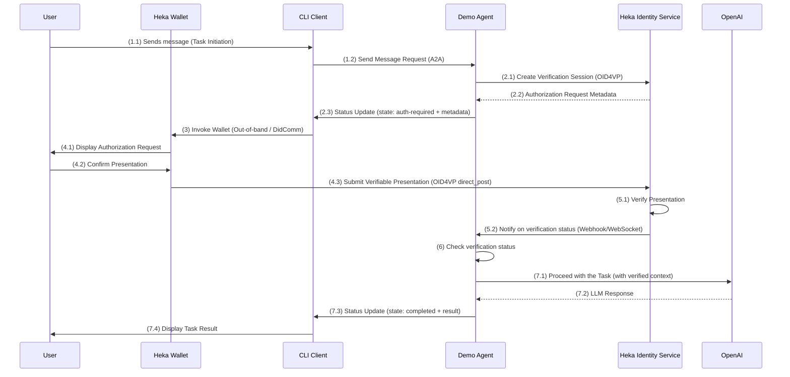

# Agent-to-Agent (A2A) + OID4VP integration demo

This demo is built around one of the relevant use cases for Agentic AI identity – VC-based authentication for interaction with Agents.
It leverages [Agent-to-Agent (A2A)](https://a2a-protocol.org/latest/specification/) and [OpenID for Verifiable Presentations](https://openid.net/specs/openid-4-verifiable-presentations-1_0.html) protocols, specifically demonstrating how to use OID4VP for A2A Task Authentication by implementing [OID4VP In-Task Authentication extension for A2A](https://github.com/DSRCorporation/a2a-oid4vp-in-task-auth-extension/blob/main/v1/spec.md).

The demo is built using [Genkit](https://genkit.dev/) with the OpenAI API.
Heka Identity Platform is used as a decentralized identity wallet / agent providing support for OID4VP (for both Holder and Verifier parties).

## Scenario and Demo Flow

This demo showcases how an AI agent can request additional authentication from a user using the **OID4VP** protocol and how Heka Identity Platform enables such capabilities.

The **Demo Agent** acts as an AI-powered assistant capable of processing user queries and generating responses using Genkit and the OpenAI API.
The agent is configured to require the user to present a verifiable credential via OID4VP before fulfilling any requests.

The following mapping applies for roles/parties described in [OID4VP In-Task Authentication extension spec](https://github.com/DSRCorporation/a2a-oid4vp-in-task-auth-extension/blob/main/v1/spec.md):
- A2A Client → [CLI client](src/cli.ts)
- A2A Server → [Demo Agent Server](src/agent/index.ts)
- OID4VP Wallet → [Heka Mobile Wallet](../../heka-wallet)
- OID4VP Verifier → [Heka Identity Service](../../heka-identity-service)

**High-level demo flow:**


1.  **Task Initiation**: A user sends a message to the Demo Agent via the A2A CLI.
2.  **In-Task Authentication Request**: The Demo Agent determines that the context/task requires authentication. It invokes Heka Identity Service API to generate OID4VP authorization request, then sends CLI Client a `status-update` with the `auth-required` state that also includes OID4VP authorization request metadata.
3.  **OID4VP Flow Initiation**: The CLI client receives a status update, detects the OID4VP request, and invokes Heka Wallet to present the requested credentials.
4.  **Sharing Verifiable Presentation**: Heka Wallet receives OID4VP authorization request, displays requested credentials / claims to a user. After receiving a confirmation, the wallet sends authorization response (containing Verifiable Presentation) to Heka Identity Service verifier endpoint (OID4VP `direct_post.jwt` response mode).
5.  **Verification**: Heka Identity Service receives and validates the presentation, then sends an out-of-band notification with verification status to the Demo Agent.
6.  **In-Task Authentication Completion**: The Demo Agent receives notification and makes a decision on proceeding with a task based on verification status.
7.  **Task Execution**: Once In-Task authentication is successfully completed, the Demo Agent proceeds with the task and generates a response.

## Running the Demo

### 1. Install prerequisites

- Node.js (v18 or higher)
- yarn v4.9.4
- Docker
- An OpenAI API key

### 2. Create an env file

Copy the `.env.example` file to `.env`:

```bash
cp .env.example .env
```

You can use `.env` file to define environment-specific and general settings for the demo.
Most values defined in `.env.example` follow default values used by Heka Identity Platform and can be kept as is.

However, there are values that need to be manually set up:
- `OPENAI_API_KEY` - add your OpenAI API key there
- `HOLDER_PUBLIC_DID` - needs to be added after setting up the Heka Wallet app (see the [Run Heka Wallet section](#run-heka-wallet-on-mobile-device))

Other supported values:
- `DEMO_AGENT_PORT` - Port to be used by the Demo Agent server, defaults to `10003`
- `CLI_CLIENT_PORT` - Port to be used by CLI Client inbound transport (DidComm inbound transport, used for Mobile Wallet invocation), defaults to `3010`
- `IDENTITY_SERVICE_URL` - URL of local instance of Heka Identity Service, defaults to `http://localhost:3000`. Must be changed if host, port, or API prefix configuration of the instance differs from default values
- `IDENTITY_SERVICE_ACCESS_TOKEN` - Heka Identity Service API token, default value is a demo token with extremely long validity period. Must be changed if JWT configuration for Heka Identity Service instance was changed

### 3. Setup Heka Identity Platform

#### Run Heka Identity Service

Before running Heka Identity Service instance locally, you need to set up a local instance of Postgres DB.
This can be done using the following command:

```bash
docker run --name heka-identity-service-postgres -e POSTGRES_DB=heka-identity-service -e POSTGRES_USER=heka -e POSTGRES_PASSWORD=heka1 -p 5432:5432 -d postgres
```

To run the service instance itself, go to [Heka Identity Service folder](../../heka-identity-service), install dependencies, set up the DB migrations, and run the app:

```bash
yarn install && yarn migration:up
yarn start
```

#### Run Heka Wallet on mobile device

It's strongly recommended to use Android device for running the demo since ADB allows convenient port reversing to localhost.

If you'd like to use an iOS device, you'll need to expose Heka Identity Service ports so they're available for the Heka Wallet app on the mobile device.
This can be done by using your local network IP address in the Identity Service configuration or leveraging services such as [ngrok](https://ngrok.com).

Install dependencies in `heka-wallet` folder:

```bash
yarn install
```

Open `.env` file in `heka-wallet/app` folder and set `ENABLE_EXAMPLE_CREDENTIAL` value to `true`.

(Android only) Enable TCP port reversal to enable access to `localhost` OID4VC endpoints of Heka Identity Service:

```bash
adb devices
# Find your device id in "adb devices" output
adb -s <your-device-id> reverse tcp:3003 tcp:3003
```

Run the application:

```bash
# For Android
yarn run:android

# For iOS
yarn run:ios
```

Keep Heka Wallet logs open, complete wallet onboarding process, and find a log in the following format: `Public DID: did:peer:...`.
Copy `<public-did-peer>` value and put it into the demo `.env` file as `HOLDER_PUBLIC_DID` value.
The public DID value is persistent and will be relevant until you fully reset your Heka Wallet app (by removing application data or reinstalling it completely).

Example did:peer value: `did:peer:2.Vz6MkoWbqNzyX3BaTpECoQsCkKrww2n2pu6F7ZUYq7msD8q5P.Ez6LShhHdY2PSw9QRStKsPoEYDZyfDV8pTGuWTbdc6a2VdsnT.SeyJzIjoid3NzOi8vY2EuZGV2LjIwNjAuaW8iLCJ0IjoiZGlkLWNvbW11bmljYXRpb24iLCJwcmlvcml0eSI6MCwicmVjaXBpZW50S2V5cyI6WyIja2V5LTEiXSwiciI6WyJkaWQ6a2V5Ono2TWtyZ2lmbW1nN1ZWOHQzUXdKTGJnaVJEZnF4UFVyWXZQd25Qcm9aeEQ4cTduTCN6Nk1rcmdpZm1tZzdWVjh0M1F3SkxiZ2lSRGZxeFBVcll2UHduUHJvWnhEOHE3bkwiXX0`

### 4. Install demo dependencies

Install dependencies in `demo` folder:

```bash
yarn install
```

### 5. Run the Agent

In one terminal, start the Demo Agent:

```bash
yarn agent
```

The agent will start an A2A server (port 10003, can be changed using `DEMO_AGENT_PORT` env variable).

### 6. Run the CLI Client

In a second terminal, start the CLI Client:

```bash
yarn client
```

The CLI Client will start an inbound DidComm transport that will use port 3010 (can be changed using `CLI_CLIENT_PORT` env variable).

### 7. Try out integration with the Agent

You can now interact with the Demo Agent. The first message you send will trigger the OID4VP authentication flow.
Heka Wallet app on your mobile device will display the OID4VP authorization request shortly after – you need to explicitly accept it in the app to pass additional auth requested by A2A Server.

## Disclaimer
Important: The code provided is for demonstration purposes and illustrates the
mechanics of leveraging Heka Identity Platform for Agent-to-Agent (A2A) protocol flow with OID4VP In-Task Authentication Extension. When building production applications,
it is critical to treat any agent operating outside of your direct control as a
potentially untrusted entity.

The demonstrated flow involves usage of OID4VP Response Mode `direct_post` that is vulnerable to Session Fixation attacks ([Ref](https://openid.net/specs/openid-4-verifiable-presentations-1_0.html#name-session-fixation)). Production deployments must provide an additonal security mechanism to prevent such attacks.

All data received from an external agent—including but not limited to its AgentCard,
messages, artifacts, and task statuses—should be handled as untrusted input. For
example, a malicious agent could provide an AgentCard containing crafted data in its
fields (e.g., description, name, skills.description). If this data is used without
sanitization to construct prompts for a Large Language Model (LLM), it could expose
your application to prompt injection attacks.  Failure to properly validate and
sanitize this data before use can introduce security vulnerabilities into your
application.

Developers are responsible for implementing appropriate security measures, such as
input validation and secure handling of credentials to protect their systems and users.
